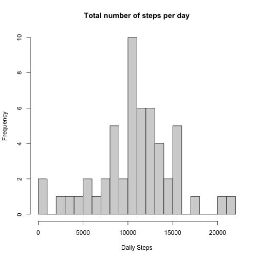
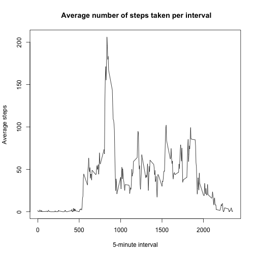
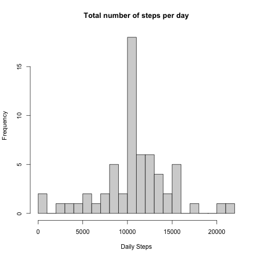
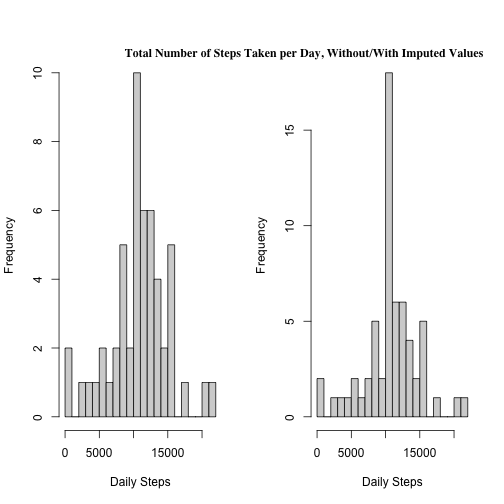
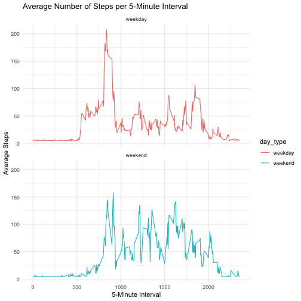

## Introduction

This R Markdown file was created for the Coursera course "Reproducible Research" which is the fifth course of a "Foundations in R" specialization. This document is part of the first course project for the class.

The data provided for use was collected from a single individual wearing a "personal activity monitoring device" such as a FitBit. Data was collected over a two-month period in five-minute intervals.

## The Assignment

### Q1:Loading and preprocessing the data

The data must be downloaded online and present in the current working directory. The `unzip` function extracts the CSV file from the zip file. The `read.csv` function reads in the csv file into R. The `as.Date` function ensures that the dates in the date column are in the correct format.

```r
unzip("activity.zip")
activity <- read.csv("activity.csv")
activity$date <- as.Date(activity$date)
```

Check if the data was loaded into R correctly by using the following functions. The functions help visualize what data you are working with.


```r
head(activity)
```

```
##   steps       date interval
## 1    NA 2012-10-01        0
## 2    NA 2012-10-01        5
## 3    NA 2012-10-01       10
## 4    NA 2012-10-01       15
## 5    NA 2012-10-01       20
## 6    NA 2012-10-01       25
```

```r
summary(activity)
```

```
##      steps             date               interval     
##  Min.   :  0.00   Min.   :2012-10-01   Min.   :   0.0  
##  1st Qu.:  0.00   1st Qu.:2012-10-16   1st Qu.: 588.8  
##  Median :  0.00   Median :2012-10-31   Median :1177.5  
##  Mean   : 37.38   Mean   :2012-10-31   Mean   :1177.5  
##  3rd Qu.: 12.00   3rd Qu.:2012-11-15   3rd Qu.:1766.2  
##  Max.   :806.00   Max.   :2012-11-30   Max.   :2355.0  
##  NA's   :2304
```

```r
str(activity)
```

```
## 'data.frame':	17568 obs. of  3 variables:
##  $ steps   : int  NA NA NA NA NA NA NA NA NA NA ...
##  $ date    : Date, format: "2012-10-01" "2012-10-01" "2012-10-01" ...
##  $ interval: int  0 5 10 15 20 25 30 35 40 45 ...
```

### Q2: What is mean total number of steps taken per day?

First we are calculating the total steps taken per day: We first count how many observations per day are present and use this count to calculate the average daily steps. This average is stored in `steps_daily`. `na.rm = TRUE` because the assignment states that NA values can be ignored.


```r
date_counts <- table(activity$date)["2012-10-02"]
steps_daily <- sum(activity$steps, na.rm = TRUE)/date_counts
steps_daily
```

```
## 2012-10-02 
##   1981.278
```

The second part of Q2 asks us to create a histogram displaying frequencies of daily steps. To do this, we first create a new data frame (called `daily_steps`) that includes the total steps for each day with recorded values. Then the data is presented in a histogram


```r
daily_steps <- aggregate(steps ~ date, data = activity, sum)
hist(daily_steps$steps, breaks = 20, main = "Total number of steps per day", xlab = "Daily Steps")
```



The third part of Q2 asks to calculate the mean and median of the total number of steps taken per day. R has neat functions in its base package:


```r
mean(daily_steps$steps)
```

```
## [1] 10766.19
```

```r
median(daily_steps$steps)
```

```
## [1] 10765
```
The values are pretty similar.

### Question 3: What is the average daily activity pattern?

To make a time series plot of the 5-minute intervals and the average numbers of steps taken across all days, we first create a new data frame called `interval_average`, consisting of two columns (interval and steps taken during this interval). We use the plot function of the base R package to visualize the data. `type = "l"` is used to get a line instead of single dots. 


```r
interval_average <- aggregate(steps ~ interval, data = activity, mean)
plot(x=interval_average$interval, y=interval_average$steps, type= "l", main = " Average number of steps taken per interval", xlab = "5-minute interval", ylab= "Average steps")
```



`maximumsteps` stores the maximum amount of steps in one interval overall and 'maximuminterval' stores the interval where the maximum amount of steps were achieved. 


```r
maximumsteps <- max(interval_average$steps)
maximuminterval <- interval_average$interval[interval_average$steps == maximumsteps]
```
Let's print both of them


```r
maximumsteps 
```

```
## [1] 206.1698
```

```r
maximuminterval 
```

```
## [1] 835
```

### Q4: Imputing missing values

First we calculate and report the total number of missing values:

```r
na_count <- sum(is.na(activity$steps))
```
Then we replace missing values with the overall mean in a new data frame called `activity 2`

```r
activity2 <- activity
activity2$steps[is.na(activity2$steps)] <- mean(activity2$steps, na.rm=TRUE)
```
In order to create a histogram like in Q2 we have to create a new datafram that includes steps for each day

```r
daily_steps2 <- aggregate(steps ~ date, data = activity2, sum)
hist(daily_steps2$steps, breaks = 20, main = "Total number of steps per day", xlab = "Daily Steps")
```


Now we calculate the mean and median for the new dataset

```r
mean(daily_steps2$steps)
```

```
## [1] 10766.19
```

```r
median(daily_steps2$steps)
```

```
## [1] 10766.19
```

And let's compare them with the ones from the `average` dataset.

```r
mean(daily_steps$steps)
```

```
## [1] 10766.19
```

```r
median(daily_steps$steps)
```

```
## [1] 10765
```

The mean value is the same as we have replaced the NA values with this exact mean value. The median changed marginally due to the replacement of the NA values. The following code compares the data of `average` and `average2` data frames.


```r
par(mfrow = c(1, 2))
hist(daily_steps$steps, breaks = 20, main=" ", xlab = "Daily Steps")
hist(daily_steps2$steps, breaks = 20, main=" ", xlab = "Daily Steps")
mtext("Total Number of Steps Taken per Day, Without/With Imputed Values",
      adj=0.95, family="serif", font=2)
```



### Question 5: Are there differences in activity patterns between weekdays and weekends?
In order to code part 5 efficiently, we need to load a couple of packages and create a new factor variable for the type of day. The variable will be added as a new column in the `activity2` dataframe. 

```r
library(ggplot2)
library(dplyr)
library(tidyr)

activity2$day_type <- ifelse(weekdays(activity$date) %in% c("Saturday", "Sunday"), "weekend", "weekday")
```
Now we aggregate data by interval, day_type and calculate average steps

```r
avg_steps <- activity2 %>%
  group_by(interval, day_type) %>%
  summarize(avg_steps = mean(steps, na.rm = TRUE))
```

```
## `summarise()` has grouped output by 'interval'. You can override using the `.groups` argument.
```

The ggplot2 package helps us create the following graphs

```r
ggplot(avg_steps, aes(x = interval, y = avg_steps, color = day_type)) +
  geom_line() +
  facet_wrap(~day_type, ncol = 1) +
  labs(title = "Average Number of Steps per 5-Minute Interval",
       x = "5-Minute Interval",
       y = "Average Steps") +
  theme_minimal()
```



